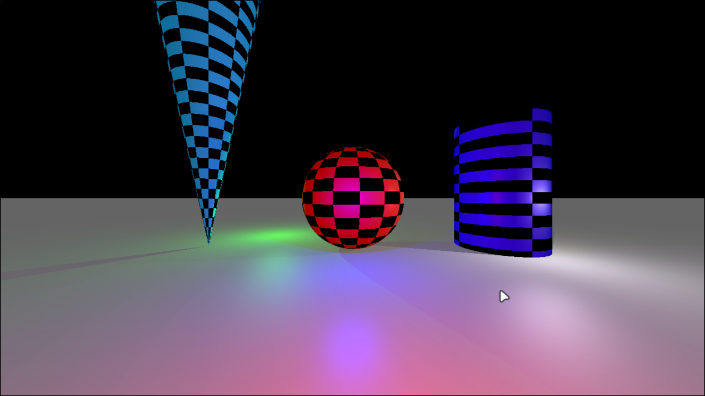
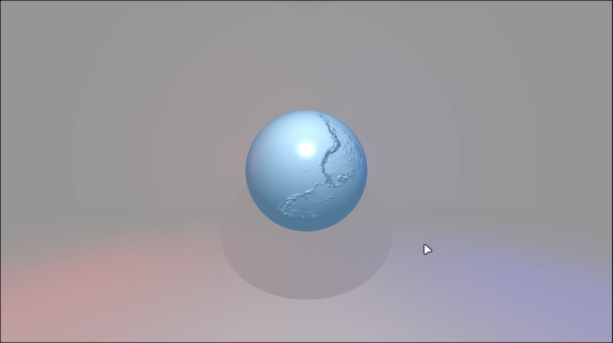

# 🎨 MiniRT - 42 Project (125/100) (Made together with [musturu](https://github.com/musturu))

## 🌟 Overview

### ✅ [125/125]

**MiniRT** is an educational project introducing the fundamentals of ray tracing, developed as part of the 42 curriculum.  
It is a C program that generates images of 3D scenes described in a simple `.rt` file format.  
The purpose of this project is to provide hands-on experience with mathematical concepts in computer graphics, including 3D geometry, light, and shading.





---

## 📋 Table of Contents

- [Features](#features)
- [Getting Started](#getting-started)
- [Scene File Format](#scene-file-format)
- [Controls](#controls)
- [License](#license)

---

## ✨ Features

### Mandatory

- **Window Management**: Uses the [MiniLibX](https://github.com/42Paris/minilibx-linux) library for window creation and management.
- **Basic Geometric Objects**: Render planes, spheres, and cylinders.
- **Transformations**: Translate and rotate all objects, lights, and the camera.
- **Lighting**:
  - Ambient lighting ensures no area is completely dark.
  - Single spot light for diffuse lighting and hard shadows.
- **Camera**: Configurable position, direction, and FOV.
- **Scene Parsing**: Reads `.rt` files describing the camera, lights, and objects.

### Bonus

- **Cone Object**: Render cones in addition to spheres, planes, and cylinders.
- **Phong Reflection Model**: Specular highlights for realistic lighting.
- **Texture Mapping**:
  - Checkerboard pattern on any object.
  - Bump (normal) mapping for visual surface detail.
- **Multiple Lights**: Illuminate scenes with multiple colored spot lights.

---

## 🚀 Getting Started

### Prerequisites

- A C compiler (e.g., `gcc` or `clang`)
- The `make` utility
- [MiniLibX](https://github.com/42Paris/minilibx-linux) library (Linux or macOS)

### Installation

```bash
git clone https://github.com/yourusername/minirt.git
cd minirt
make
```

### Usage

To render a scene, run:

```bash
./miniRT scenes/example.rt
```

Sample scene files are provided in the `scenes/` directory.

---

## 📝 Scene File Format

Scene files (`.rt`) are plain text, each line describes an element:

- **Ambient Light**: `A [ratio] [R,G,B]`
- **Camera**: `C [x,y,z] [orientation_vec] [FOV]`
- **Light**: `L [x,y,z] [brightness] [R,G,B]`
- **Sphere**: `sp [x,y,z] [diameter] [R,G,B] [bump_map_path]`
- **Plane**: `pl [x,y,z] [normal_vec] [R,G,B] [bump_map_path]`
- **Cylinder**: `cy [x,y,z] [axis_vec] [diameter] [height] [R,G,B] [bump_map_path]`
- **Cone**: `co [x,y,z] [axis_vec] [angle] [R,G,B] [bump_map_path]`

#### Example

```
C 0,0,0 0,0,1 90
A 0 100,100,100
L 1.0,0.0,2 1 255,0,0
L 16,0,16 1 200,200,200
L -10,0,26 1 0,255,0
L 0,0,13 1 0,0,255
sp 0,0,20 5 150,0,0 ./textures/earthbump1k.xpm
cy 15.0,0.0,20.6 0.0,1.0,0.0 8 15 10,0,155
co -15,-5,20.6  0.0,1.0,0.0  10  10,110,155
pl 0,-5,20 0,1,0 100,100,100

```

---

## 🎮 Controls

### General Controls

- **Exit Program**: Press the `ESC` key or click the red cross on the window frame to close the window and quit the program cleanly.

### Camera Controls

- **Select Camera**: Press the `'c'` key to select the camera for movement.
- **Toggle Camera Rotation Mode**: Press the `'v'` key to toggle the ability to rotate the camera.
- **Move Camera**:
  - `Up`/`Down` arrow keys: Move the camera up and down.
  - `Left`/`Right` arrow keys: Move the camera left and right.
  - `'w'` / `'s'` keys: Move the camera forward and backward.
- **Rotate Camera**: When camera rotation mode is active, click and drag the **middle mouse button** to rotate the camera's view.

### Object & Light Controls

#### Selection

- **Select Object**: Click on an object with the **left, middle, or right mouse button** to select it for manipulation.
- **Select Light**: Press the `'l'` key to cycle through and select the lights in the scene for movement.

#### Translation (Movement)

- **Translate Selected Object**: Click and drag the **left mouse button** to move the selected object on the X and Y axes relative to the camera view.
- **Translate Selected Object (Z-axis)**: Use the **mouse scroll wheel** up and down to move the selected object forward and backward along the Z-axis.
- **Translate Selected Light**: With a light selected, use the arrow keys and the `'w'` and `'s'` keys to move it.
  - `Up`/`Down` arrow keys: Move the light up and down.
  - `Left`/`Right` arrow keys: Move the light left and right.
  - `'w'` / `'s'` keys: Move the light forward and backward.

#### Rotation

- **Rotate Selected Object**: Click and drag the **middle mouse button** to rotate the selected object.  
  This does not apply to spheres.

#### Transformation (Resizing)

- **Transform Selected Object**: Click and drag the **right mouse button** to resize the selected object.
  - **Sphere**: Changes the radius.
  - **Cylinder**: Dragging horizontally changes the radius, and dragging vertically changes the height.
  - **Cone**: Changes the angle of the cone.

### Feature Toggles (Bonus)

- **Toggle Bump Mapping**: With an object selected, press the `'b'` key to turn bump mapping on or off for that object.
- **Toggle Checkerboard Pattern**: With an object selected, press the `'n'` key to turn the checkerboard pattern on or off for that object.

---

## License

This project is part of the 42 curriculum and follows its academic policies.
